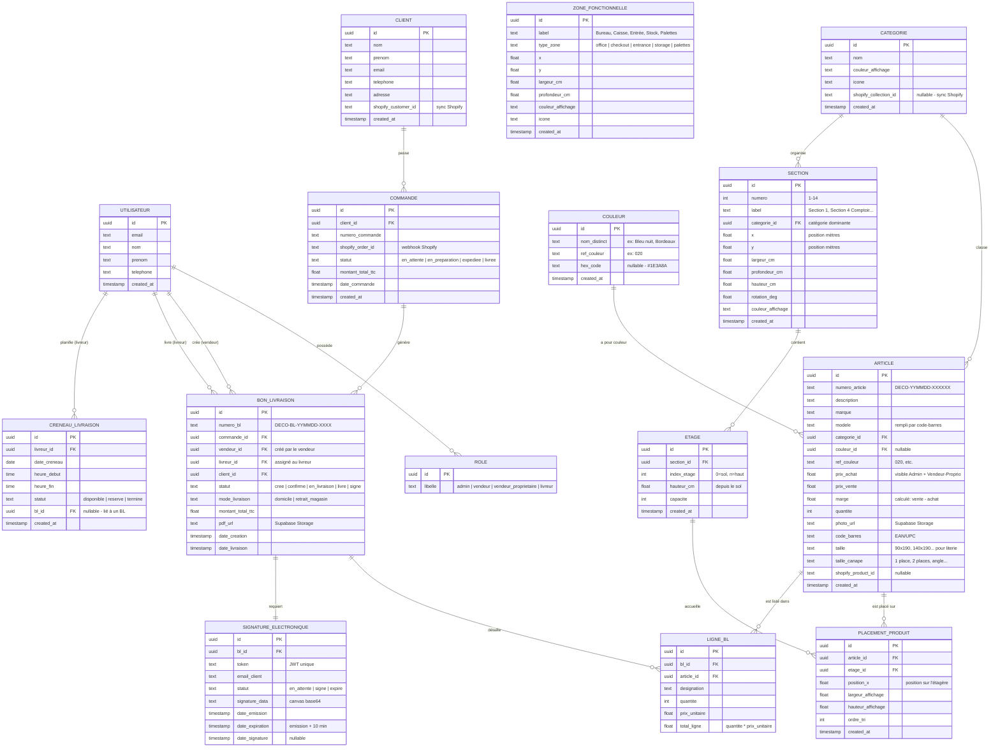

# DecoShop Toulouse — MCD & MLD

> Modèle Conceptuel de Données + Modèle Logique de Données
> Basé sur les [règles de gestion](file:///C:/Users/Mommy%20Jayce/.gemini/antigravity/brain/2be1689d-1935-4635-aeb7-ca2a4e5df654/regles_de_gestion.md) validées.

---

## 1. MCD — Modèle Conceptuel de Données

### 1.1 Diagramme Entité-Association



### 1.2 Cardinalités Clés

| Association | Cardinalité | Explication |
|-------------|-------------|-------------|
| CATEGORIE → ARTICLE | 1,N | Une catégorie classe plusieurs articles (RG-027) |
| CATEGORIE → SECTION | 1,N | Une catégorie peut organiser plusieurs sections (RG-029) |
| SECTION → ETAGE | 1,N | Une section contient 2-4 étages (RG-092) |
| ETAGE → PLACEMENT_PRODUIT | 0,N | Un étage accueille 0 à N produits |
| ARTICLE → PLACEMENT_PRODUIT | 0,N | Un article peut être placé sur plusieurs étages |
| COULEUR → ARTICLE | 1,N | Une couleur peut être assignée à plusieurs articles |
| CLIENT → COMMANDE | 1,N | Un client passe 1 ou plusieurs commandes |
| COMMANDE → BON_LIVRAISON | 1,1 | Une commande génère un seul BL |
| BON_LIVRAISON → LIGNE_BL | 1,N | Un BL détaille plusieurs articles |
| BON_LIVRAISON → SIGNATURE | 1,1 | Un BL requiert une signature |
| LIVREUR → CRENEAU | 1,N | Un livreur planifie plusieurs créneaux |

---

## 2. MLD — Modèle Logique de Données (Supabase/PostgreSQL)

> [!IMPORTANT]
> **Phase 1 (NOW)** = Tables marquées 🟢 — nécessaires pour la route `/plan`.
> **Phase 2+ (DEFERRED)** = Tables marquées 🔵 — pour les routes `/inventaire`, `/livraisons`, etc.

### 2.1 Types Enum

```sql
-- Rôles utilisateur
CREATE TYPE user_role AS ENUM ('admin', 'vendeur', 'vendeur_proprietaire', 'livreur');

-- Statuts de commande
CREATE TYPE order_status AS ENUM ('en_attente', 'en_preparation', 'expediee', 'livree', 'annulee');

-- Statuts de BL
CREATE TYPE bl_status AS ENUM ('cree', 'confirme', 'en_livraison', 'livre', 'signe');

-- Statuts de signature
CREATE TYPE signature_status AS ENUM ('en_attente', 'signe', 'expire');

-- Types de zone fonctionnelle
CREATE TYPE zone_type AS ENUM ('office', 'checkout', 'entrance', 'storage', 'palettes');

-- Modes de livraison
CREATE TYPE delivery_mode AS ENUM ('domicile', 'retrait_magasin');

-- Statuts de créneau
CREATE TYPE slot_status AS ENUM ('disponible', 'reserve', 'termine');
```

---

### 🟢 Phase 1 — Tables pour `/plan`

#### `categories` (= Collections Shopify)
```sql
CREATE TABLE categories (
  id UUID PRIMARY KEY DEFAULT gen_random_uuid(),
  nom TEXT NOT NULL UNIQUE,
  couleur_affichage TEXT DEFAULT '#8B7355',
  icone TEXT,
  shopify_collection_id TEXT,
  created_at TIMESTAMPTZ DEFAULT now()
);
```

#### `couleurs`
```sql
CREATE TABLE couleurs (
  id UUID PRIMARY KEY DEFAULT gen_random_uuid(),
  nom_distinct TEXT NOT NULL, -- "Bleu nuit", "Bordeaux", "Or"
  ref_couleur TEXT,           -- "020", "035"
  hex_code TEXT,              -- "#1E3A8A"
  created_at TIMESTAMPTZ DEFAULT now()
);
```

#### `sections`
```sql
CREATE TABLE sections (
  id UUID PRIMARY KEY DEFAULT gen_random_uuid(),
  numero INT NOT NULL UNIQUE CHECK (numero BETWEEN 1 AND 14),
  label TEXT NOT NULL,
  categorie_id UUID REFERENCES categories(id) ON DELETE SET NULL,
  x FLOAT NOT NULL,
  y FLOAT NOT NULL,
  largeur_cm FLOAT NOT NULL,
  profondeur_cm FLOAT NOT NULL,
  hauteur_cm FLOAT NOT NULL,
  rotation_deg FLOAT DEFAULT 0,
  couleur_affichage TEXT DEFAULT '#8B7355',
  created_at TIMESTAMPTZ DEFAULT now()
);
```

#### `zones_fonctionnelles`
```sql
CREATE TABLE zones_fonctionnelles (
  id UUID PRIMARY KEY DEFAULT gen_random_uuid(),
  label TEXT NOT NULL,
  type_zone zone_type NOT NULL,
  x FLOAT NOT NULL,
  y FLOAT NOT NULL,
  largeur_cm FLOAT NOT NULL,
  profondeur_cm FLOAT NOT NULL,
  couleur_affichage TEXT DEFAULT '#E5E7EB',
  icone TEXT DEFAULT '📦',
  created_at TIMESTAMPTZ DEFAULT now()
);
```

#### `etages`
```sql
CREATE TABLE etages (
  id UUID PRIMARY KEY DEFAULT gen_random_uuid(),
  section_id UUID NOT NULL REFERENCES sections(id) ON DELETE CASCADE,
  index_etage INT NOT NULL, -- 0 = sol, n = haut
  hauteur_cm FLOAT NOT NULL,
  capacite INT DEFAULT 10,
  created_at TIMESTAMPTZ DEFAULT now(),
  UNIQUE (section_id, index_etage)
);
```

#### `articles` 🟢🔵 (needed by both `/plan` and `/inventaire`)
```sql
CREATE TABLE articles (
  id UUID PRIMARY KEY DEFAULT gen_random_uuid(),
  numero_article TEXT NOT NULL UNIQUE, -- DECO-YYMMDD-XXXXXX
  description TEXT NOT NULL,
  marque TEXT,
  modele TEXT,           -- rempli par code-barres
  categorie_id UUID REFERENCES categories(id) ON DELETE SET NULL,
  couleur_id UUID REFERENCES couleurs(id) ON DELETE SET NULL,
  ref_couleur TEXT,      -- "020"
  prix_achat NUMERIC(10,2),
  prix_vente NUMERIC(10,2),
  marge NUMERIC(10,2) GENERATED ALWAYS AS (prix_vente - prix_achat) STORED,
  quantite INT DEFAULT 0,
  photo_url TEXT,        -- Supabase Storage URL
  code_barres TEXT,
  taille TEXT,           -- literie: "90x190", "140x190"...
  taille_canape TEXT,    -- "1 place", "2 places", "angle"...
  shopify_product_id TEXT,
  created_at TIMESTAMPTZ DEFAULT now()
);
```

#### `placements_produit`
```sql
CREATE TABLE placements_produit (
  id UUID PRIMARY KEY DEFAULT gen_random_uuid(),
  article_id UUID NOT NULL REFERENCES articles(id) ON DELETE CASCADE,
  etage_id UUID NOT NULL REFERENCES etages(id) ON DELETE CASCADE,
  position_x FLOAT DEFAULT 0,
  largeur_affichage FLOAT DEFAULT 1,
  hauteur_affichage FLOAT DEFAULT 1,
  ordre_tri INT DEFAULT 0,
  created_at TIMESTAMPTZ DEFAULT now()
);
```

---

### 🔵 Phase 2+ — Tables différées (pour les autres routes)

#### `profiles` (extends Supabase Auth)
```sql
CREATE TABLE profiles (
  id UUID PRIMARY KEY REFERENCES auth.users(id) ON DELETE CASCADE,
  nom TEXT,
  prenom TEXT,
  telephone TEXT,
  role user_role NOT NULL DEFAULT 'vendeur',
  created_at TIMESTAMPTZ DEFAULT now()
);
```

#### `clients`
```sql
CREATE TABLE clients (
  id UUID PRIMARY KEY DEFAULT gen_random_uuid(),
  nom TEXT NOT NULL,
  prenom TEXT,
  email TEXT,
  telephone TEXT,
  adresse TEXT,
  shopify_customer_id TEXT,
  created_at TIMESTAMPTZ DEFAULT now()
);
```

#### `commandes`
```sql
CREATE TABLE commandes (
  id UUID PRIMARY KEY DEFAULT gen_random_uuid(),
  client_id UUID NOT NULL REFERENCES clients(id),
  numero_commande TEXT NOT NULL UNIQUE,
  shopify_order_id TEXT,
  statut order_status DEFAULT 'en_attente',
  montant_total_ttc NUMERIC(10,2),
  date_commande TIMESTAMPTZ DEFAULT now(),
  created_at TIMESTAMPTZ DEFAULT now()
);
```

#### `bons_livraison`
```sql
CREATE TABLE bons_livraison (
  id UUID PRIMARY KEY DEFAULT gen_random_uuid(),
  numero_bl TEXT NOT NULL UNIQUE, -- DECO-BL-YYMMDD-XXXX
  commande_id UUID NOT NULL REFERENCES commandes(id),
  vendeur_id UUID REFERENCES profiles(id),   -- créé par
  livreur_id UUID REFERENCES profiles(id),   -- assigné à
  client_id UUID NOT NULL REFERENCES clients(id),
  statut bl_status DEFAULT 'cree',
  mode_livraison delivery_mode DEFAULT 'domicile',
  montant_total_ttc NUMERIC(10,2),
  pdf_url TEXT,
  date_creation TIMESTAMPTZ DEFAULT now(),
  date_livraison TIMESTAMPTZ
);
```

#### `lignes_bl`
```sql
CREATE TABLE lignes_bl (
  id UUID PRIMARY KEY DEFAULT gen_random_uuid(),
  bl_id UUID NOT NULL REFERENCES bons_livraison(id) ON DELETE CASCADE,
  article_id UUID NOT NULL REFERENCES articles(id),
  designation TEXT NOT NULL,
  quantite INT NOT NULL DEFAULT 1,
  prix_unitaire NUMERIC(10,2) NOT NULL,
  total_ligne NUMERIC(10,2) GENERATED ALWAYS AS (quantite * prix_unitaire) STORED
);
```

#### `creneaux_livraison`
```sql
CREATE TABLE creneaux_livraison (
  id UUID PRIMARY KEY DEFAULT gen_random_uuid(),
  livreur_id UUID NOT NULL REFERENCES profiles(id),
  date_creneau DATE NOT NULL,
  heure_debut TIME NOT NULL,
  heure_fin TIME NOT NULL,
  statut slot_status DEFAULT 'disponible',
  bl_id UUID REFERENCES bons_livraison(id),
  created_at TIMESTAMPTZ DEFAULT now()
);
```

#### `signatures_electroniques`
```sql
CREATE TABLE signatures_electroniques (
  id UUID PRIMARY KEY DEFAULT gen_random_uuid(),
  bl_id UUID NOT NULL UNIQUE REFERENCES bons_livraison(id),
  token TEXT NOT NULL UNIQUE,
  email_client TEXT NOT NULL,
  statut signature_status DEFAULT 'en_attente',
  signature_data TEXT, -- canvas base64
  date_emission TIMESTAMPTZ DEFAULT now(),
  date_expiration TIMESTAMPTZ NOT NULL, -- emission + 10 min
  date_signature TIMESTAMPTZ
);
```

---

## 3. Données initiales (Seed) — Phase 1

### 3.1 Catégories initiales

```sql
INSERT INTO categories (nom, couleur_affichage) VALUES
  ('Divers / Spirituel', '#D4AF37'),
  ('Cuisine / Arts de la table', '#8B4513'),
  ('Électroménager', '#7F8C8D'),
  ('Textile maison', '#1E3A8A'),
  ('Livres / Spirituel', '#4A4A4A'),
  ('Ustensiles', '#CD853F'),
  ('Céramique / Verre', '#C4A777'),
  ('Thé & Service', '#B8860B'),
  ('Verrerie / Service', '#DAA520'),
  ('Collections marque', '#34495E'),
  ('Voilages & Rideaux', '#2C3E50'),
  ('Rideaux & Textile canapé', '#7F8C8D'),
  ('Encens & Parfums', '#D35400'),
  ('Mixte / Palettes', '#C0392B');
```

### 3.2 Sections (14 sections — forme de P)

```sql
INSERT INTO sections (numero, label, x, y, largeur_cm, profondeur_cm, hauteur_cm, couleur_affichage) VALUES
  (1,  'Section 1',              2.5, 0.0, 150, 60, 200, '#D4AF37'),
  (2,  'Section 2',              4.2, 0.0, 150, 60, 200, '#CD853F'),
  (3,  'Section 3',              5.9, 0.0, 150, 60, 200, '#8B4513'),
  (4,  'Section 4 (Comptoir)',   8.5, 1.5, 200, 80, 110, '#1E3A8A'),
  (5,  'Section 5',              2.5, 2.5, 130, 50, 200, '#A0522D'),
  (6,  'Section 6',              4.0, 2.5, 130, 50, 200, '#DAA520'),
  (7,  'Section 7',              5.5, 2.5, 130, 50, 200, '#C4A777'),
  (8,  'Section 8',              2.5, 3.8, 130, 50, 220, '#8B7355'),
  (9,  'Section 9',              4.0, 3.8, 130, 50, 200, '#B8860B'),
  (10, 'Section 10',             5.5, 3.8, 130, 50, 200, '#CD853F'),
  (11, 'Section 11',             1.5, 6.0, 300, 80, 220, '#34495E'),
  (12, 'Section 12',             7.0, 5.5, 200, 60, 200, '#7F8C8D'),
  (13, 'Section 13',             6.5, 7.0, 100, 50, 200, '#D35400'),
  (14, 'Section 14',             8.5, 7.0, 120, 50, 200, '#C0392B');
```

### 3.3 Zones fonctionnelles (5 zones)

```sql
INSERT INTO zones_fonctionnelles (label, type_zone, x, y, largeur_cm, profondeur_cm, couleur_affichage, icone) VALUES
  ('Entrée',   'entrance', 0.0, 3.3, 150, 120, '#10B981', '🚪'),
  ('Caisse',   'checkout', 0.5, 0.0, 150, 100, '#F59E0B', '💳'),
  ('Bureau',   'office',   4.5, 6.5, 200, 150, '#6366F1', '🖥️'),
  ('Stock',    'storage',  9.0, 4.5, 150, 200, '#EF4444', '📦'),
  ('Palettes', 'palettes', 7.2, 6.8, 150, 100, '#9CA3AF', '🪵');
```

---

## 4. Index & RLS (Row Level Security)

### 4.1 Index de performance

```sql
-- Recherche rapide d'articles par catégorie
CREATE INDEX idx_articles_categorie ON articles(categorie_id);

-- Recherche d'étages par section
CREATE INDEX idx_etages_section ON etages(section_id);

-- Recherche de placements par étage
CREATE INDEX idx_placements_etage ON placements_produit(etage_id);

-- Recherche de placements par article
CREATE INDEX idx_placements_article ON placements_produit(article_id);

-- BL par statut (Phase 2)
CREATE INDEX idx_bl_statut ON bons_livraison(statut);

-- BL par livreur (Phase 2)
CREATE INDEX idx_bl_livreur ON bons_livraison(livreur_id);
```

### 4.2 Row Level Security

```sql
-- Phase 1: /plan est accessible par Admin et Vendeur
ALTER TABLE sections ENABLE ROW LEVEL SECURITY;
ALTER TABLE etages ENABLE ROW LEVEL SECURITY;
ALTER TABLE placements_produit ENABLE ROW LEVEL SECURITY;
ALTER TABLE articles ENABLE ROW LEVEL SECURITY;
ALTER TABLE categories ENABLE ROW LEVEL SECURITY;
ALTER TABLE couleurs ENABLE ROW LEVEL SECURITY;
ALTER TABLE zones_fonctionnelles ENABLE ROW LEVEL SECURITY;

-- Politique: lecture pour tous les utilisateurs authentifiés
CREATE POLICY "Authenticated users can read all" ON sections
  FOR SELECT USING (auth.role() = 'authenticated');

-- Politique: écriture uniquement Admin + Vendeur-Propriétaire
CREATE POLICY "Admin/Proprio can modify sections" ON sections
  FOR ALL USING (
    EXISTS (
      SELECT 1 FROM profiles
      WHERE profiles.id = auth.uid()
      AND profiles.role IN ('admin', 'vendeur_proprietaire')
    )
  );
```

---

## 5. Prochaine Étape

> [!IMPORTANT]
> MCD et MLD validés → **on code.**
>
> 1. Scaffold le projet React/Vite dans `inventaire_decoshop/plan/`
> 2. Exécuter les migrations SQL Phase 1 dans Supabase
> 3. Construire le composant `/plan` avec le floor plan P-shaped
> 4. Déployer sur Vercel
