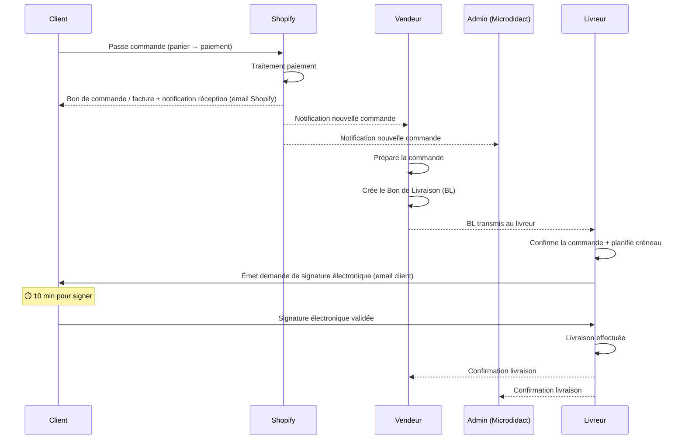

# DecoShop Toulouse — Règles de Gestion

> Document fondateur pour la conception du MCD et MLD.
> Toutes les règles numérotées (RG-XXX) servent de référence traçable.

---

## 1. Acteurs du Système

### 1.1 Les 4 Rôles

| Rôle | Qui | Accès |
|------|-----|-------|
| **Admin** | Développeurs (Microdidact) | Accès total à tout le système, configuration, déploiement |
| **Vendeur** | Propriétaire (Fayssal) + toute personne autorisée à vendre | Gestion inventaire, création BL, pas d'accès aux prix d'achat pour les vendeurs non-propriétaires |
| **Livreur** | Personnel de livraison | Interface dédiée : réception commandes, gestion créneaux (CRUD), émission signature électronique |
| **Client** | Acheteur (en magasin ou via Shopify) | Réception BL par email, signature électronique (10 min), suivi commande via Shopify |

---

### 1.2 Règles sur les Rôles

- **RG-001** : Un utilisateur possède un et un seul rôle principal.
- **RG-002** : L'Admin a accès à toutes les fonctionnalités du tableau de bord (dashboard).
- **RG-003** : Le Vendeur peut gérer l'inventaire (CRUD articles), créer des bons de livraison (BL), et consulter les prix de vente. Le Vendeur standard ne peut **PAS** voir les prix d'achat ni la marge.
- **RG-004** : Le Vendeur-Propriétaire (rôle élevé) peut voir les prix d'achat, les prix de vente, et les marges.
- **RG-005** : Le Livreur a une interface dédiée restreinte. Il ne peut **PAS** accéder à l'inventaire, aux prix, ni aux données financières.
- **RG-006** : Le Client n'a **PAS** d'interface dans le système interne. Son parcours est géré par **Shopify** (suivi commande, compte client, historique d'achats).
- **RG-007** : Chaque rôle possède des identifiants uniques (email + mot de passe), gérés via Supabase Auth.

---

## 2. Gestion de l'Inventaire

### 2.1 Articles (Produits)

- **RG-010** : Chaque article est identifié par un **numéro d'article** unique (format `DECO-YYMMDD-XXXXXX`).
- **RG-011** : Un article possède obligatoirement : **numéro d'article**, **description**, **marque**, **modèle**, **catégorie (collection)**, **prix d'achat**, **prix de vente**, **marge** (calculée), **couleur_distinct** (nom de la couleur), **ref_couleur** (code couleur type "020").
- **RG-012** : L'accent est mis sur la **description**, la **marque** et le **modèle** — ces champs sont prioritaires dans l'interface.
- **RG-013** : Un article peut avoir une **photo** (prise par caméra ou importée).
- **RG-014** : Un article peut avoir un **code-barres** (EAN/UPC) scanné.
- **RG-015** : Quand le code couleur est scanné (ex : "Arenzo 020"), le système doit automatiquement séparer le **nom** ("Arenzo") de la **référence** ("020") et les stocker distinctement.
- **RG-016** : La **catégorie** (appelée **collection** sur Shopify) et la **couleur** sont toutes deux sélectionnées via des **listes déroulantes**. Si la catégorie ou la couleur n'existe pas, l'utilisateur peut en **ajouter une nouvelle** dynamiquement.
- **RG-017** : Les champs **emplacement** et **fournisseur** sont retirés du formulaire de saisie. Ils restent visibles et éditables uniquement dans le tableau de l'inventaire.
- **RG-018** : Les champs financiers (**prix d'achat**, **prix de vente**, **marge**) sont affichés **uniquement dans le tableau**, pas dans le formulaire de saisie.
- **RG-019** : La **marge** est calculée automatiquement : `marge = prix_de_vente - prix_d_achat`.
- **RG-020** : La **taille des lits** doit être stockée pour les articles de literie. Tailles standard : 90×190, 140×190, 160×200, 180×200 cm.
- **RG-020b** : Pour les **canapés**, la catégorie de taille est stockée : 1 place, 2 places, 3 places, angle, convertible, etc.
- **RG-021** : Un article est **rattaché à une section** du magasin (Section 1 à 14) et à un **étage** (shelf) spécifique dans cette section.

### 2.2 Catégories (= Collections Shopify)

- **RG-025** : Les catégories (appelées **collections** sur Shopify) sont dynamiques et gérées par l'Admin/Vendeur.
- **RG-026** : Une catégorie a un **nom**, une **couleur** d'affichage, et un **icône** optionnel.
- **RG-027** : Un article appartient à **une seule catégorie** à la fois.
- **RG-028** : Les catégories initiales couvrent : Ramadan & Aïd, Salon, Tapis, Lanternes & Luminaires, Vaisselle orientale, Calligraphie & Cadres, Arts de la table, Cadeaux, Promos, Nouveautés, Canapés, Literie, Miroirs, Poufs & Assises, Cuisine, Textile maison, Encens & Parfums, Jeux & Livres, Nettoyage & Entretien, Électroménager.
- **RG-029** : Les **sections du magasin** (1–14) sont répertoriées / organisées par catégorie. Chaque section est associée à une ou plusieurs catégories dominantes.

### 2.3 Analyse IA (Gemini)

- **RG-030** : L'IA Gemini Vision analyse les photos pour pré-remplir les champs (marque, modèle, description, catégorie, prix estimé).
- **RG-031** : On reste sur une solution **gratuite** mais performante. L'IA doit être entraînée / connaître le catalogue DecoShop.
- **RG-032** : Les résultats IA sont des **suggestions** — le vendeur valide ou corrige avant enregistrement.
- **RG-033** : Le scan code-barres extrait le contenu du code et le place dans le champ **modèle**. Le contenu extrait est ensuite utilisé pour identifier et répertorier le produit via l'IA Gemini (PAS Open Food Facts — DecoShop ne vend PAS de produits alimentaires).

### 2.4 Stockage & Synchronisation

- **RG-040** : La base de données centrale et **unique** est **Supabase** (PostgreSQL). Pas de Google Sheets.
- **RG-041** : ~~Google Sheets~~ — **SUPPRIMÉ**. Supabase est la seule source de vérité.
- **RG-042** : Les photos sont stockées dans **Supabase Storage**, pas en localStorage (limitation 5–10MB).
- **RG-043** : Le système doit pouvoir fonctionner **localement** (mode hors-ligne) avec synchronisation au retour en ligne.

---

## 3. Flux d'Achat et Livraison

### 3.1 Processus de Vente



### 3.2 Règles du Flux

- **RG-050** : Quand un client effectue un achat, **trois notifications** sont envoyées : au **client** (bon de commande/facture via Shopify), au **vendeur**, et à l'**admin** (Microdidact). Vendeur et Admin sont **deux personnes/entités distinctes**.
- **RG-051** : Le client reçoit un **bon de commande / facture** + une **notification de réception de la commande** (géré par Shopify).
- **RG-052** : Le vendeur crée un **Bon de Livraison (BL)** dans le dashboard. Le BL contient : numéro BL, date, articles, adresse client, montant, délai estimé.
- **RG-053** : Le BL est transmis au **livreur**. C'est le livreur qui confirme la commande et émet la **signature électronique** à l'adresse email du client. Le BL n'est **PAS** envoyé directement au client par email.
- **RG-054** : Le BL alimente automatiquement la **base de données** (historique des livraisons).
- **RG-055** : Le BL est la base de travail du **livreur** pour la planification.

### 3.3 Règles du Livreur

- **RG-060** : Le livreur a une interface dédiée avec les fonctionnalités suivantes :
  - Voir les BL qui lui sont attribués
  - Gérer ses **créneaux** de livraison (CRUD : créer, lire, modifier, supprimer)
  - Émettre une **demande de signature électronique** vers l'email du client
  - Marquer une livraison comme effectuée (cocheurs/checkboxes)
- **RG-061** : Quand le vendeur crée un BL, le livreur émet une **signature électronique** à l'adresse email du client.
- **RG-062** : Le client dispose de **10 minutes** pour signer électroniquement (le lien expire après).
- **RG-063** : La signature électronique constitue un **accusé de réception** de la livraison.
- **RG-064** : Le livreur peut voir la **fiche client** (nom, adresse, téléphone, articles commandés) mais **PAS** les prix d'achat.
- **RG-065** : L'historique des livraisons est conservé dans la base de données (traçabilité).

### 3.4 Bon de Livraison (BL)

- **RG-070** : Le BL est un document structuré contenant :
  - Numéro de BL (auto-généré, format `DECO-BL-YYMMDD-XXXX`)
  - Date de création
  - Informations vendeur (nom, magasin)
  - Informations client (nom, adresse, email, téléphone)
  - Liste des articles (désignation, quantité, prix unitaire, total ligne)
  - Montant total TTC
  - Mode de livraison (livraison à domicile / retrait magasin)
  - Signature électronique du client (statut : en attente / signé / expiré)
- **RG-071** : Le BL est généré en **PDF** et envoyé par email.
- **RG-072** : Le BL est stocké dans Supabase Storage pour archivage.

---

## 4. Périmètre Shopify vs Système Interne

> [!IMPORTANT]
> Tout ce qui concerne le **parcours client** (front-end e-commerce) est géré par **Shopify**. Le système interne gère la **logique back-office**.

### 4.1 Ce que Shopify gère directement

| Fonctionnalité | Géré par |
|---------------|----------|
| Catalogue produits en ligne (pages produit) | ✅ Shopify |
| Panier d'achat + checkout | ✅ Shopify |
| Paiement (CB, 3× sans frais) | ✅ Shopify Payments |
| Compte client + historique d'achats | ✅ Shopify |
| Suivi de commande client | ✅ Shopify |
| Emails transactionnels (confirmation commande) | ✅ Shopify |
| Gestion des retours (14 jours) | ✅ Shopify |
| Code promo (RAMADAN15, etc.) | ✅ Shopify |
| SEO + référencement pages produit | ✅ Shopify |
| Thème front-end (conversion decoshop-v3 → Liquid) | ✅ Shopify |

### 4.2 Ce que le système interne (Dashboard) gère

| Fonctionnalité | Géré par |
|---------------|----------|
| Gestion de l'inventaire (CRUD articles, photos, AI) | ✅ Dashboard |
| Plan 3D du magasin (visualisation, placement produits) | ✅ Dashboard |
| Création et gestion des Bons de Livraison (BL) | ✅ Dashboard |
| Interface livreur (créneaux, signatures, suivi) | ✅ Dashboard |
| Gestion des rôles et permissions (Admin/Vendeur/Livreur) | ✅ Dashboard |
| Analyse IA des produits (Gemini Vision) | ✅ Dashboard |
| Prix d'achat, marge (données confidentielles) | ✅ Dashboard |
| Notifications internes (admin, vendeur) | ✅ Dashboard |

### 4.3 Connexion Dashboard ↔ Shopify

- **RG-080** : Le catalogue produit est synchronisé **Dashboard → Shopify** via l'API Shopify Admin.
- **RG-081** : Les nouvelles commandes sont remontées **Shopify → Dashboard** via webhook Shopify (`orders/create`).
- **RG-082** : Les stocks sont synchronisés bidirectionnellement (vente en magasin → -1 sur Shopify, vente Shopify → -1 dans l'inventaire).
- **RG-083** : Le thème Shopify sera la conversion du site `decoshop-v3` actuel en Liquid.
- **RG-084** : DecoShop n'a **pas encore de site web** — uniquement TikTok (@decoshoptoulouse) et Instagram (@decoshoptlse31). Le site Shopify sera leur premier site.

---

## 5. Plan 3D du Magasin (Visualiseur)

### 5.1 Structure Physique

- **RG-090** : Le magasin a une surface de ~250m² en **forme de P** (corps principal + aile droite qui s'étend vers le fond).
- **RG-091** : Le magasin comporte **14 sections** d'exposition (numérotées 1 à 14).
- **RG-092** : Chaque section comporte des **étages** (étagères) avec un nombre et une hauteur variables.
- **RG-093** : Le magasin comporte **5 zones fonctionnelles** non-produit : Entrée, Caisse, Bureau, Stock, Palettes (PL).
- **RG-094** : La Section 4 est le **comptoir frontal** (nouvelle) — hauteur réduite, sert aussi de zone de vente.
- **RG-095** : La Section 11 est la plus grande — elle accueille les grands articles (voilages, rideaux).

### 5.2 Plan du Magasin (forme de P)

La **tête du P** (partie arrondie/carrée) est formée par le **Bureau**, les **Sections 13–14**, et les **Palettes (PL)**.
Le **corps du P** (barre verticale) descend sur la droite avec le Stock, la Section 12, la Section 4 (comptoir).
Le **ventre du P** (parties intérieures) contient les Sections 1–3 (front), 5–10 (mid-grid), 11, la Caisse et l'Entrée.

```
  ┌───────────────────────┬──────────────┬──────┬─────┬──────────┐  ← TÊTE DU P
  │                       │              │Sec.13│ PL  │ Sec. 14  │
  │     Section 11        │    BUREAU    │      │     │          │
  │  (voilages/rideaux)   │   (office)   ├──────┘     └──────────┤
  │                       │              │     PL        PL      │
  │                       │              ├───────────────────────┤
  └───────────────────────┴──────────────┤    Section 12         │
                                         ├───────────────────────┤
                                         │       STOCK           │
           ┌───────────┬───────────┬─────┤      (storage)        │
   ENTRÉE  │ Section 8 │ Section 9 │S.10 ├───────────────────────┤
    ←→     ├───────────┼───────────┼─────┤                       │  CORPS
   (door)  │ Section 5 │ Section 6 │ S.7 │    Section 4          │  DU P
           └───────────┴───────────┴─────┤    Comptoir frontal   │   │
                                         │    (nouvelle)         │   │
    ┌────────┐  ┌───────────┬─────────┬──┤                       │   │
    │ CAISSE │  │ Section 1 │ Sect. 2 │S3│                       │   ↓
    │(cash)  │  │           │         │  │                       │
    └────────┘  └───────────┴─────────┴──┴───────────────────────┘

                       FRONT (window / street)
```

> Le magasin est en **forme de P** : la **tête** (Bureau + Sections 13–14 + Palettes) forme le bloc carré en haut. Le **corps** (Section 4/Comptoir + Stock + Section 12) descend verticalement sur toute la droite. Le **ventre** (Sections 1–3, 5–10, 11, Caisse, Entrée) occupe l'espace intérieur à gauche.

### 5.3 Fonctionnalités du Visualiseur

- **RG-100** : Le visualiseur est accessible via la route `/plan` dans le dashboard admin.
- **RG-101** : L'affichage par défaut est en **2D/2.5D** (vue d'en haut). Un mode 3D avec orbite caméra sera ajouté ultérieurement.
- **RG-102** : L'admin peut **sélectionner une section** (ou multi-sélection) pour voir/modifier les produits qui y sont assignés.
- **RG-103** : Les produits sur les étagères sont représentés par des **rectangles/carrés** avec **photo + texte** (marque, modèle).
- **RG-104** : L'admin peut **glisser-déposer** des produits entre sections/étagères.
- **RG-105** : L'admin peut **redimensionner** la représentation visuelle d'un produit (comme un flexbox).
- **RG-106** : L'admin peut **déplacer** et **réorganiser** la structure des sections.
- **RG-107** : Toutes les modifications du plan sont **persistées dans Supabase** en temps réel.
- **RG-108** : Le plan est directement connecté à la base de données de l'inventaire (même Supabase).

---

## 6. Catalogue Produits par Section

> Inventaire réel du magasin DecoShop Toulouse (avril 2026) :

### Section 1 — Divers / Spirituel / Enfants
| # | Article |
|---|---------|
| 1 | Eau bénite |
| 2 | Planche à dessin avec projection |
| 3 | Lampe en forme de lune |
| 4 | Mobile pour bébé |
| 5 | Ourson |
| 6 | Tapis de prière électronique |
| 7 | Veilleuse |
| 8 | Lessive |
| 9 | Bouteilles en verre |
| 10 | Moule à pâtisserie |

### Section 2 — Cuisine / Arts de la table
| # | Article |
|---|---------|
| 1 | Brûleur d'encens |
| 2 | Kit de casseroles |
| 3 | Pot à épices |
| 4 | Couteau |
| 5 | Plateau à thé |
| 6 | Plateau inox |
| 7 | Saladier inox |
| 8 | Plaque à induction |
| 9 | Cocotte |
| 10 | Cocotte avec revêtement antiadhésif |
| 11 | Dessous argenté et doré (pâtisserie) |
| 12 | Power kitchen machine |

### Section 3 — Électroménager / Cuisine
| # | Article |
|---|---------|
| 1 | Mélangeur de lait |
| 2 | Air fryer |
| 3 | Lessive |
| 4 | Marmite |
| 5 | Kit poêles et casseroles |
| 6 | Kit poêles |
| 7 | Sopalin |
| 8 | Papier toilette |

### Section 4 — Textile (Comptoir frontal)
| # | Article |
|---|---------|
| 1 | Plaid |
| 2 | Taie d'oreiller |
| 3 | Drap housse |

### Section 5 — Livres / Spirituel / Cuisine
| # | Article |
|---|---------|
| 1 | Livre |
| 2 | Planche à dessin avec projection |
| 3 | Coran |
| 4 | Boîte pour ranger le Coran |
| 5 | Jeu de cartes |
| 6 | Poêle en fonte pour faire le pain |
| 7 | Boîte de bonbons |
| 8 | Pot à sucre |
| 9 | Pot à épices |
| 10 | Lessive |
| 11 | Casseroles (lot de 3) |

### Section 6 — Ustensiles / Cuisine
| # | Article |
|---|---------|
| 1 | Couverture pour micro-ondes |
| 2 | Coffret de couverts |
| 3 | Bouilloire avec socle |
| 4 | Ustensiles en bois |
| 5 | Couteau |
| 6 | Ustensiles en inox |
| 7 | Set soup lunch box |

### Section 7 — Céramique / Verre
| # | Article |
|---|---------|
| 1 | Bouilloire |
| 2 | Pot en céramique |
| 3 | Bol en céramique |
| 4 | Saladier en verre |

### Section 8 — Thé & Service / Parfums
| # | Article |
|---|---------|
| 1 | Parfum |
| 2 | Verres à thé |
| 3 | Pot à sucre en verre |
| 4 | Théière en verre |
| 5 | Théière en céramique |
| 6 | Coffret de couverts |
| 7 | Pot à bonbons en verre |
| 8 | Alcohol stove shelf |
| 9 | Petite assiette en inox |

### Section 9 — Verrerie / Service
| # | Article |
|---|---------|
| 1 | Distributeur 3 litres |
| 2 | Théière en plastique |
| 3 | Pot à sucre |
| 4 | Pot de décoration |
| 5 | Pot à bonbons |
| 6 | Service carafe et verres |
| 7 | Pot en verre |
| 8 | Bol en verre |
| 9 | Saucier |
| 10 | Verre à pied |

### Section 10 — Collections marque (Terra, Capital, etc.)
| # | Article |
|---|---------|
| 1 | Terra |
| 2 | Chubby Snack |
| 3 | Capital Snack |
| 4 | Egg |
| 5 | Capital Tea |
| 6 | Verre à café et saucier |
| 7 | Tasse à thé et saucier |
| 8 | Capital Coffee |
| 9 | Linen |

### Section 11 — Voilages & Rideaux (grande section)
| # | Article |
|---|---------|
| 1 | Voilage |
| 2 | Voilage brodé |
| 3 | Rideau linen |
| 4 | Rideau velvet |
| 5 | Rideau occultant |

### Section 12 — Rideaux & Textile canapé
| # | Article |
|---|---------|
| 1 | Rideau occultant |
| 2 | Drap housse pour canapé |

### Section 13 — Spirituel / Textile / Cuisine
| # | Article |
|---|---------|
| 1 | Drap housse canapé |
| 2 | Babouches |
| 3 | Voile |
| 4 | Lalezar |
| 5 | Qamis |
| 6 | Coran |
| 7 | Porte-Coran |
| 8 | Brûleur d'encens |
| 9 | Cuisine |
| 10 | Four |

### Section 14 — Mixte / Palettes
| # | Article |
|---|---------|
| 1 | Verre à thé |
| 2 | Assiette |
| 3 | Vase |
| 4 | Tableau |
| 5 | Four |
| 6 | Support |
| 7 | Saladier en inox |
| — | **Palette 1** |
| 8 | Tapis pour la cuisine |
| 9 | Air fryer |
| 10 | Bol |
| 11 | Assiette |
| 12 | Marmite inox |
| — | **Palette 2** |
| 13 | Tapis de prière |
| 14 | Cocotte |
| 15 | Couscoussier |
| 16 | Verres à thé |
| 17 | Plateau inox |
| 18 | Plateaux ovales dorés et inox |

---

## 7. Règles Techniques

### 7.1 Base de Données

- **RG-110** : Supabase PostgreSQL comme SGBD principal.
- **RG-111** : URL projet : `https://dzjebcipoqgjvxxmlcry.supabase.co`
- **RG-112** : Row Level Security (RLS) activé sur toutes les tables, filtré par rôle utilisateur.
- **RG-113** : Les images sont stockées dans Supabase Storage (bucket `products`).
- **RG-114** : Les BL au format PDF sont stockés dans Supabase Storage (bucket `delivery-notes`).

### 7.2 Stack Technique

- **RG-120** : Front-end : React (Vite) + Three.js / Canvas pour le plan 3D.
- **RG-121** : Authentification : Supabase Auth (email/password).
- **RG-122** : API : Supabase client-side (real-time subscriptions).
- **RG-123** : IA : Google Gemini Vision (modèle gratuit : gemini-2.0-flash).
- **RG-124** : E-commerce : Shopify (thème Liquid converti depuis decoshop-v3).
- **RG-125** : Email BL : Service d'envoi (EmailJS ou Supabase Edge Functions + Resend).
- **RG-126** : Signature électronique : lien temporaire (10 min) avec token unique, interface web simple (canvas signature).
- **RG-127** : ~~Synchronisation Sheets~~ — **SUPPRIMÉ**. Supabase uniquement.

### 7.3 Sécurité

- **RG-130** : Les clés API ne sont **JAMAIS** exposées dans le code source côté client.
- **RG-131** : Les prix d'achat et les marges ne sont visibles que par les rôles Admin et Vendeur-Propriétaire.
- **RG-132** : L'URL du BL de signature expire après 10 minutes (token JWT avec `exp`).
- **RG-133** : Toutes les actions critiques (suppression, modification de rôle) nécessitent une confirmation.

---

## 8. Récapitulatif des Entités Identifiées (pour le MCD)

| Entité | Description |
|--------|-------------|
| **Utilisateur** | Admin, Vendeur, Livreur (via Supabase Auth) |
| **Rôle** | Admin, Vendeur, Vendeur-Propriétaire, Livreur |
| **Article** | Produit en inventaire (numéro d'article, description, marque, modèle, catégorie/collection, prix d'achat, prix de vente, marge, couleur_distinct, ref_couleur, photo, quantité...) |
| **Catégorie** | Classification dynamique des articles |
| **Section** | Zone d'exposition dans le magasin (1–14) |
| **Étage (Shelf)** | Étagère dans une section |
| **Zone Fonctionnelle** | Entrée, Caisse, Bureau, Stock, Palettes |
| **Placement Produit** | Position d'un article sur une étagère dans une section |
| **Client** | Acheteur (données gérées par Shopify, référencées dans le BL) |
| **Commande** | Commande client (webhook Shopify → dashboard) |
| **Bon de Livraison (BL)** | Document de livraison créé par le vendeur |
| **Ligne BL** | Détail d'un article dans un BL |
| **Créneau Livraison** | Plage horaire définie par le livreur (CRUD) |
| **Signature Électronique** | Token de signature lié à un BL, avec date d'expiration (10 min) |
| **Paramètres** | Configuration système (clé API, URL Sheets, modèle IA, etc.) |

---

## 9. Prochaine Étape

> [!IMPORTANT]
> Ce document de règles de gestion est **la base contractuelle** pour le MCD et le MLD.
> Une fois validé, nous procéderons à :
> 1. **MCD** (Modèle Conceptuel de Données) — diagramme entité-association
> 2. **MLD** (Modèle Logique de Données) — schéma relationnel Supabase/PostgreSQL
> 3. **Implémentation** — création des tables dans Supabase + développement du plan 3D
